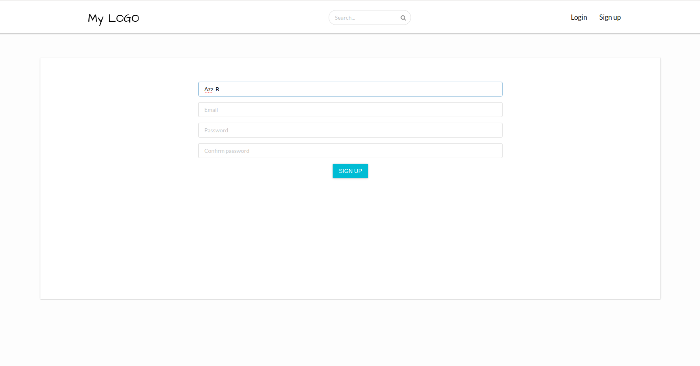

# Startup project
Startup application project using MERN (Mongoose Express React Nodejs) Stack.

## Tech
#### Front-end
react, redux, redux-sagas, redux-form, react-router-v4, reselect, material-ui, react-semantic-ui, styled-component

#### Back-end
nodejs, express, mongoose, nodemailer, jsonwebtoken

## Include
  - Authentifaction JWT
  - Signup SignIn logic with email verification using nodemailer

### run
- ``yarn install``
- ``yarn test``
- ``yarn run start:dev`` or  ``yarn run start:prod``

### Todo
- Admin panel

-----------------------------
Base Template [react-template](https://github.com/AZZB/react-template/)
